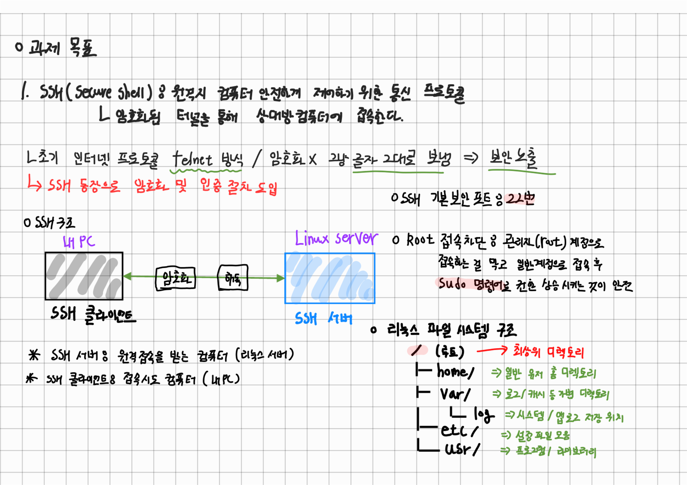
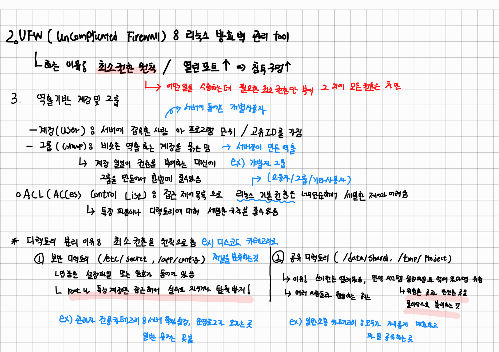
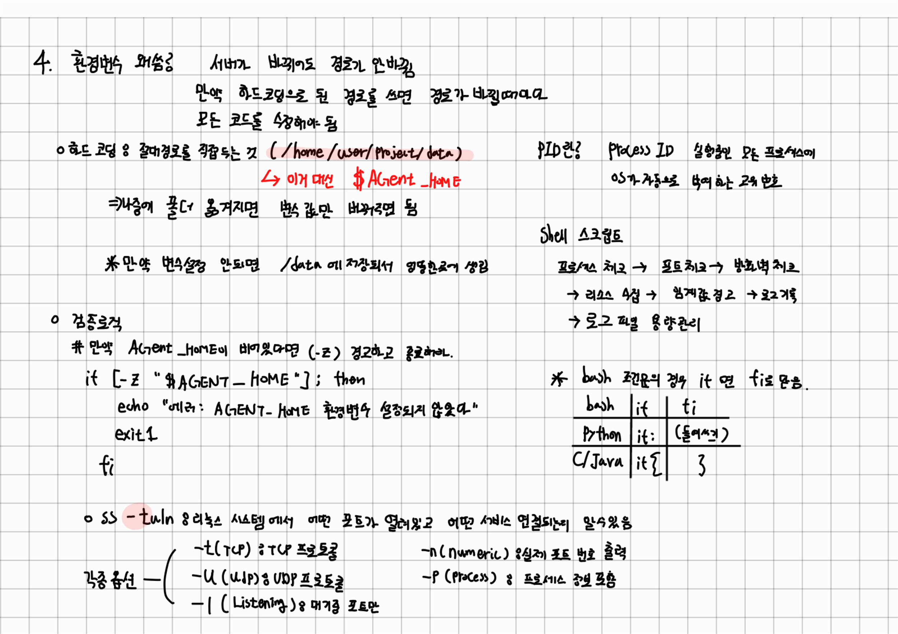

# Linux와 OS 개념
- [이전 화면으로 돌아가기](./)
- [B1-1 미션 수행 파일 가기](./Result.md)
---

## 목차
0. 개념 노트
1. 파일 시스템과 디렉토리 구조
2. 사용자와 그룹 관리
3. 파일 권한과 ACL
4. 프로세스 관리
5. 네트워크와 포트
6. SSH 보안 설정
7. 방화벽
8. 환경 변수
9. Bash 쉘 스크립트
10. cron 자동화
11. 로그 관리

---

| 용어 | 한 줄 설명 |
| ---- | --------- |
| **터미널 / 쉘 (shell)** | 키보드로 명령어를 쳐서 컴퓨터에 시키는 입력 창. 우리가 쓰는 쉘은 `bash`. |
| **루트 (root)** | 리눅스의 최고 권한자. 아이디는 `root`, 사용자 번호(UID)는 0. 뭐든지 할 수 있어서 위험하기도 함. |
| **sudo** | "지금 이 한 줄만 root 권한으로 실행" 이라는 뜻. (super user do) |
| **패키지 / `apt`** | 우분투에서 프로그램을 설치하는 공식 도구. `apt-get install 패키지명`. |
| **데몬 (daemon)** | 백그라운드에서 계속 돌아가는 서비스 프로그램 (예: `sshd` SSH 데몬, `cron` 데몬). |
| **systemd / `systemctl`** | 우분투의 서비스 관리자. `systemctl start/stop/restart/enable 서비스명`. |
| **포트 (port)** | 네트워크의 "문 번호". 한 IP에서 여러 서비스를 구분하려고 0~65535 중 하나를 골라 사용. SSH=22, HTTP=80, 우리 앱=15034. |
| **방화벽 (firewall)** | 어떤 포트로 들어오고 나가는 통신을 허용/차단할지 결정하는 문지기. 여기서는 `ufw` 사용. |
| **계정(user) / 그룹(group)** | 리눅스는 "누가" 무엇을 할 수 있는지를 계정/그룹 단위로 관리. 한 사람이 여러 그룹에 속할 수 있다. |
| **권한 (permission)** | 파일/폴더마다 "읽기(r) 쓰기(w) 실행(x)"을 누구에게 줄지 정함. `chmod` 로 변경. |
| **ACL (Access Control List)** | 기본 권한(rwx-rwx-rwx) 만으로 부족할 때 "특정 그룹에 추가로 권한 부여" 하는 정밀 도구. `setfacl/getfacl`. |
| **환경 변수** | 모든 프로그램이 공유하는 "전역 메모"(예: `AGENT_HOME=/home/agent-admin/agent-app`). `export` 로 등록. |
| **crontab** | "매분/매일 N시에 이 명령을 자동 실행" 같은 예약 스케줄. `cron` 데몬이 실행해 준다. |
| **`#` 으로 시작하는 줄** | 코드/명령 블록 안에서 `#` 은 주석 (실행되지 않는 메모). |

---
### 개념 노트
<table class="center">
  <tr>
    <td></td>
    <td></td>
    <td></td>
  </tr>
  <tr align="center">
    <td><b>필기 노트 01 (SSH 개념 / 리눅스 파일 시스템 구조)</b></td>
    <td><b>필기 노트 02 (UFW / 권한)</b></td>
    <td><b>필기 노트 03 (환경변수 / 검증 로직)</b></td>
  </tr>
</table>

## 1. 파일 시스템과 디렉토리 구조

리눅스는 모든 것을 파일로 다룬다. 최상위 디렉토리는 `/` (루트)이며 아래로 뻗어 나간다.

```
/
├── home/        # 일반 사용자 홈 디렉토리
├── var/         # 로그, 캐시 등 가변 데이터
│   └── log/     # 시스템/앱 로그 저장 위치
├── etc/         # 설정 파일 모음
└── usr/         # 프로그램, 라이브러리
```

이번 미션에서 직접 다루는 경로

| 경로 | 용도 |
| --- | --- |
| `/home/agent-admin/agent-app` | AGENT_HOME (앱 루트) |
| `/var/log/agent-app` | 모니터링 로그 저장 |
| `/etc/ssh/sshd_config` | SSH 설정 파일 |

---

## 2. 사용자와 그룹 관리

### 개념

리눅스는 다중 사용자 운영체제다. 모든 프로세스와 파일에는 **소유자(user)** 와 **그룹(group)** 이 존재한다.

### 주요 명령어

```bash
# 사용자 생성
useradd -m -s /bin/bash agent-admin

# 비밀번호 설정
passwd agent-admin

# 그룹 생성
groupadd agent-common

# 사용자를 그룹에 추가
usermod -aG agent-common agent-admin

# 사용자 정보 확인
id agent-admin
# 출력 예시: uid=1001(agent-admin) gid=1001(agent-admin) groups=1001(agent-admin),1002(agent-common),1003(agent-core)
```

### 관련 파일

| 파일 | 내용 |
| --- | --- |
| `/etc/passwd` | 사용자 목록 |
| `/etc/group` | 그룹 목록 및 멤버 |
| `/etc/shadow` | 암호화된 비밀번호 |

### 왜 역할 기반 계정을 나누는가

루트 계정 하나로 모든 작업을 하면 실수 하나가 시스템 전체에 영향을 준다. 역할별로 계정을 분리하면 권한 범위가 제한되어 장애 영향이 최소화된다.

---

## 3. 파일 권한과 ACL

### 기본 권한 구조

```
-rwxr-x---  1  agent-dev  agent-core  monitor.sh
 ^^^         소유자        그룹
 |||
 ||+-- others (그 외)  : ---  (권한 없음)
 |+--- group           : r-x  (읽기/실행)
 +---- owner           : rwx  (읽기/쓰기/실행)
```

### 권한 숫자 표현

| 숫자 | 의미 |
| --- | --- |
| 4 | 읽기 (r) |
| 2 | 쓰기 (w) |
| 1 | 실행 (x) |

```bash
chmod 750 monitor.sh
# 7 = rwx (소유자)
# 5 = r-x (그룹)
# 0 = --- (그 외)
```

### 주요 명령어

```bash
# 소유자/그룹 변경
chown agent-dev:agent-core monitor.sh

# 권한 변경
chmod 750 monitor.sh

# 권한 확인
ls -l monitor.sh
```

### ACL (Access Control List)

기본 권한은 소유자/그룹/기타 3단계만 지정 가능하다. ACL은 특정 사용자나 그룹에 개별 권한을 추가로 부여할 때 사용한다.

```bash
# ACL 설치
apt install acl

# 특정 그룹에 rwx 권한 부여
setfacl -m g:agent-core:rwx /var/log/agent-app

# ACL 확인
getfacl /var/log/agent-app
```

---

## 4. 프로세스 관리 (PID)

### 개념

프로세스는 실행 중인 프로그램이다. 각 프로세스에는 고유한 PID(Process ID) 번호가 부여된다.

### 주요 명령어

```bash
# 전체 프로세스 목록
ps aux

# 특정 프로세스 검색
ps aux | grep agent_app.py

# 프로세스 종료
kill <PID>
kill -9 <PID>    # 강제 종료

# 실시간 프로세스 모니터링
top
htop
```

### monitor.sh에서 활용하는 방법

```bash
PID=$(pgrep -f agent_app.py)

if [ -z "$PID" ]; then
    echo "[ERROR] 프로세스가 실행 중이지 않습니다."
    exit 1
fi
```

---

## 5. 네트워크와 포트

### 개념

포트는 네트워크 통신의 문(door)이다. 서버는 특정 포트를 열고 연결을 기다린다(LISTEN). 클라이언트는 해당 포트로 접속한다.

### 주요 명령어

```bash
# 열려 있는 포트 확인
ss -tulnp

# 출력 예시
# tcp  LISTEN  0  128  0.0.0.0:15034  ...  python3

# 특정 포트 확인
ss -tulnp | grep 15034
```

### ss 출력 해석

| 컬럼 | 의미 |
| --- | --- |
| State | LISTEN = 연결 대기 중 |
| Local Address:Port | 서버가 열어 놓은 주소:포트 |
| 0.0.0.0 | 모든 네트워크 인터페이스에서 수신 |

---

## 6. SSH 보안 설정

### SSH란

원격 서버에 암호화된 연결로 접속하는 프로토콜이다. 기본 포트는 22번.

### 설정 파일

```
/etc/ssh/sshd_config
```

### 이번 미션에서 변경할 항목

```bash
# 포트 변경
Port 20022

# 루트 로그인 차단
PermitRootLogin no
```

### 설정 적용

```bash
# 설정 파일 문법 검사
sshd -t

# SSH 서비스 재시작
systemctl restart sshd

# 서비스 상태 확인
systemctl status sshd
```

### 왜 포트를 바꾸고 루트를 차단하는가

기본 포트 22번은 자동화된 해킹 도구(봇)의 주요 공격 대상이다. 포트를 바꾸면 무차별 공격 시도를 대폭 줄일 수 있다. 루트는 시스템 전체 권한을 가지므로 원격에서 직접 접근 가능하면 침해 시 피해가 치명적이다.

---

## 7. 방화벽

### UFW (Ubuntu 기본 방화벽)

```bash
# UFW 활성화
ufw enable

# 포트 허용
ufw allow 20022/tcp
ufw allow 15034/tcp

# 상태 확인
ufw status

# 출력 예시
# To                Action  From
# 20022/tcp         ALLOW   Anywhere
# 15034/tcp         ALLOW   Anywhere
```

### firewalld

```bash
# 활성화
systemctl start firewalld
systemctl enable firewalld

# 포트 허용
firewall-cmd --permanent --add-port=20022/tcp
firewall-cmd --permanent --add-port=15034/tcp
firewall-cmd --reload

# 확인
firewall-cmd --list-all
```

### 방화벽의 역할

인바운드 트래픽을 포트 단위로 필터링한다. 허용하지 않은 포트로 들어오는 모든 연결은 차단된다. “필요한 포트만 열어 두는” 최소 허용 원칙이 기본이다.

---

## 8. 환경 변수

### 개념

환경 변수는 프로세스가 실행될 때 참조하는 키-값 쌍이다. 코드에 경로를 하드코딩하지 않고 환경 변수로 관리하면 환경(개발/운영)이 바뀌어도 코드 수정 없이 동작한다.

### 기본 사용법

```bash
# 임시 설정 (현재 세션만 유효)
export AGENT_HOME=/home/agent-admin/agent-app

# 확인
echo $AGENT_HOME
printenv AGENT_HOME

# 전체 환경 변수 목록
env
```

### 영구 적용 방법

```bash
# 특정 사용자에게 적용
vi /home/agent-admin/.bashrc

# 파일 끝에 추가
export AGENT_HOME=/home/agent-admin/agent-app
export AGENT_PORT=15034
export AGENT_UPLOAD_DIR=$AGENT_HOME/upload_files
export AGENT_KEY_PATH=$AGENT_HOME/api_keys/t_secret.key
export AGENT_LOG_DIR=/var/log/agent-app

# 적용
source /home/agent-admin/.bashrc
```

---

## 9. Bash 쉘 스크립트

### 기본 구조

```bash
#!/bin/bash
# 첫 줄은 항상 인터프리터 선언 (shebang)

# 변수
NAME="agent"
echo "Hello,$NAME"

# 조건문
if [ -z "$PID" ]; then
    echo "프로세스 없음"
    exit 1
fi

# 명령어 결과를 변수에 저장
CPU=$(top -bn1 | grep "Cpu(s)" | awk '{print $2}')
```

### monitor.sh에서 자주 쓰는 패턴

```bash
# 프로세스 PID 가져오기
PID=$(pgrep -f agent_app.py)

# 포트 LISTEN 확인
ss -tulnp | grep ":15034" > /dev/null 2>&1

# CPU 사용률
CPU=$(top -bn1 | grep "Cpu(s)" | awk '{print $2}' | cut -d'%' -f1)

# 메모리 사용률
MEM=$(free | grep Mem | awk '{printf "%.1f", $3/$2 * 100}')

# 디스크 사용률
DISK=$(df / | tail -1 | awk '{print $5}' | tr -d '%')

# 로그 기록
TIMESTAMP=$(date '+%Y-%m-%d %H:%M:%S')
echo "[$TIMESTAMP] PID:$PID CPU:${CPU}% MEM:${MEM}% DISK_USED:${DISK}%" >> /var/log/agent-app/monitor.log
```

### 종료 코드 규칙

| 코드 | 의미 |
| --- | --- |
| `exit 0` | 정상 종료 |
| `exit 1` | 오류 종료 |

스크립트가 `exit 1`로 끝나면 cron이나 다른 스크립트에서 실패로 감지할 수 있다.

---

## 10. cron 자동화

### 개념

cron은 정해진 시간에 명령어나 스크립트를 자동 실행하는 스케줄러다.

### crontab 편집

```bash
# agent-admin 계정으로 crontab 편집
crontab -e

# 등록
* * * * * /home/agent-admin/agent-app/bin/monitor.sh

# 확인
crontab -l
```

### 시간 표현 형식

```
*  *  *  *  *  실행할명령어
|  |  |  |  |
|  |  |  |  +-- 요일 (0=일요일, 6=토요일)
|  |  |  +----- 월 (1-12)
|  |  +-------- 일 (1-31)
|  +----------- 시 (0-23)
+-------------- 분 (0-59)

* = 매번 (모든 값)
```

| 표현 | 의미 |
| --- | --- |
| `* * * * *` | 매분 실행 |
| `0 * * * *` | 매 정시 실행 |
| `0 9 * * 1` | 매주 월요일 9시 실행 |

---

## 11. 로그 관리

### 로그가 필요한 이유

장애 발생 시 언제, 어떤 상태에서 문제가 생겼는지 추적하기 위해서다. 로그가 없으면 재현이 어렵고 원인 분석이 불가능하다.

### 로그 작성 기본

```bash
TIMESTAMP=$(date '+%Y-%m-%d %H:%M:%S')
LOG_FILE=/var/log/agent-app/monitor.log

echo "[$TIMESTAMP] PID:$PID CPU:${CPU}% MEM:${MEM}% DISK_USED:${DISK}%" >> $LOG_FILE
```

`>>` 는 기존 파일에 이어 쓴다. `>` 는 기존 내용을 덮어쓴다.

### 로그 용량 관리 (logrotate)

로그를 방치하면 디스크를 가득 채운다. logrotate로 자동 관리한다.

```bash
# 설정 파일 생성
vi /etc/logrotate.d/agent-app

# 내용
/var/log/agent-app/monitor.log {
    size 10M        # 10MB 초과 시 rotate
    rotate 10       # 최대 10개 파일 유지
    compress        # 이전 파일 gzip 압축
    missingok       # 파일 없어도 오류 없이 진행
    notifempty      # 파일이 비어 있으면 rotate 안 함
}
```

### 스크립트 내 직접 구현 방식

```bash
LOG_FILE=/var/log/agent-app/monitor.log
MAX_SIZE=$((10 * 1024 * 1024))  # 10MB

if [ -f "$LOG_FILE" ] && [ $(stat -c%s "$LOG_FILE") -ge $MAX_SIZE ]; then
    mv "$LOG_FILE" "${LOG_FILE}.$(date '+%Y%m%d%H%M%S')"
fi
```

---

## 개념 간 연결 흐름 요약

```
계정/그룹 분리
    └── 파일 권한 + ACL 적용
            └── monitor.sh 소유/실행 권한 제어
                    └── cron이 agent-admin으로 매분 실행
                            └── 프로세스/포트/리소스 수집
                                    └── /var/log/agent-app/monitor.log 기록
                                            └── logrotate로 용량 관리
```

SSH 보안과 방화벽은 이 흐름의 바깥에서 **외부 접근 자체를 제어**하는 레이어다.
