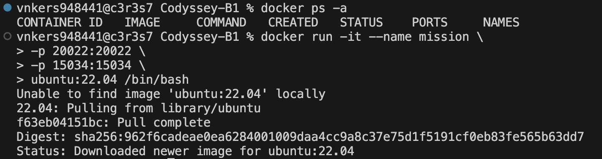
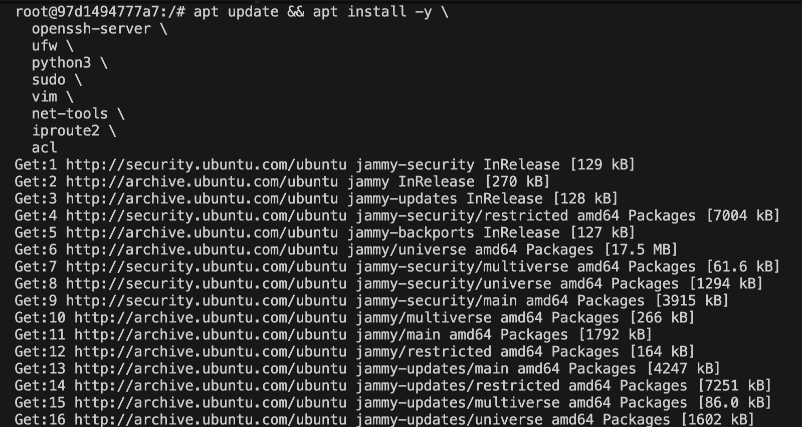
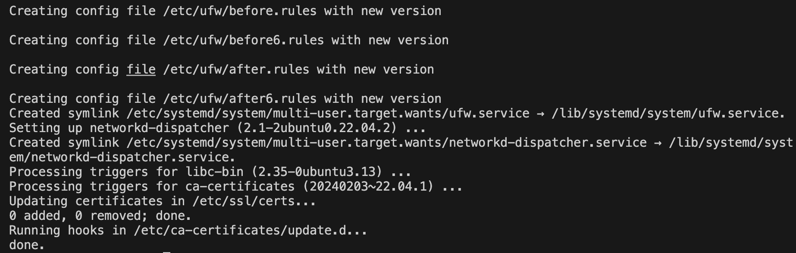
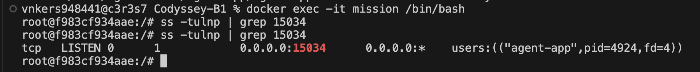

# 미션 수행
초기 도커 컨테이너와 이미지 목록 확인후 아무것도 없으므로 우분투 컨테이너 생성\
아래 스크린샷은 우분투 이미지를 받고 컨테이너 안으로 진입



## 패키지 업데이트 및 설치
각각의 패키지는 보안설정과 앱 실행 그리고 권한 관리 3가지에 필요한 도구들임\
아래는 패키지와 용도 그리고 미션에 따른 사용 용도를 구분해 놓았음
| 패키지 | 용도 | 상세 미션 |
| :--- | :--- | :--- |
| **openssh-server** | SSH 서버 | SSH 포트 20022 변경, Root 로그인 차단 |
| **ufw** | 방화벽 | 포트 허용 정책 설정 |
| **python3** | Python 실행기 | 제공된 agent 앱 실행 |
| **sudo** | 권한 상승 | 일반 계정에서 필요 시 sudo 사용 권한 부여 |
| **vim** | 텍스트 편집기 | 설정 파일 수정 및 편집 |
| **net-tools** | 네트워크 도구 | `netstat` 명령어로 포트 상태 확인 |
| **iproute2** | 네트워크 도구 | `ss -tulnp` 명령어로 포트 리슨 확인 |
| **acl** | 접근 제어 목록 | 디렉토리 세밀한 권한 설정 (`getfacl`, `setfacl`) |


```
apt update && apt install -y \
  openssh-server \
  ufw \
  python3 \
  sudo \
  vim \
  net-tools \
  iproute2 \
  acl
```

---

1. SSH 설정
먼저 SSH 설정 파일을 열고 Vim 에디터에서 포트를 변경함 22 에서 수행하라고한 20022로 수정
```
vim /etc/ssh/sshd_config
```
**port 변경**
```
Port 20022
```
**Root로그인 차단**
```
PermitRootLogin no
```
  <br>


## 문제 발생 (변경 실패)
본 내용은 수행중 실패를 보고하는 문서다.

### 1. 포트 변경 안됨

**SSH 서버 시작 및 설정 확인**
```
service ssh start      # SSH 서버 시작
ss -tulnp | grep sshd  # 포트가 잘 열렸는지 설정 확인 
```


### 해결 과정
**원인 파악:** Port 20022 앞에 '#' 이 붙어 있어서 주석 처리된 상태로 포트 기본값인 22로 뜸
- 다시 vim에디터로 가서 #Port 20022에서 있던 #을 제거하고 저장후 다시 수행
```
vim /etc/ssh/sshd_config  # SSH 설정으로 다시 들어감
Port 20022                # 주석 처리 된 '#'을 제거함
PermitRootLogin no       # 주석 처리 된 '#'을 제거함

service ssh restart     # SSH 재시작
ss -tulnp | grep sshd   # 포트 및 설정 다시 확인
```
 <br>

---
## UFW 방화벽 설정하기
포트 2개 (20022와 15034) 허용 시도 실패 

도커 컨테이너에서 UFW가 iptables권한 거부 문제로 안됨


**⌘ iptable권한이란?** 컨테이너 내부에서 호스트 시스템의 네트워크 패킷 필터링 규칙을 조작할 수 있는 권한인데,
보안을 위해 격리 되어있기 때문에 시스템의 네트워크 설정을 바꿀 수 없으나 특정 옵션을 주어서 권한을 허용 할 수 있음 

현재 컨테이너에서 나가서 **--privileged옵션 추가**해서 다시 생성

```
# 컨테이너 밖(exit 하고 난뒤)에서 실행
docker rm -f mission             # 기존에 만들었던 mission 컨테이너 삭제

docker run -it --name mission \  # mission컨테이너에 privileged 옵션 추가
  --privileged \
  -p 20022:20022 \
  -p 15034:15034 \
  ubuntu:22.04 /bin/bash
```


### 패키지 다시 설치
```
apt update && apt install -y \
  openssh-server \
  ufw \
  python3 \
  sudo \
  vim \
  net-tools \
  iproute2 \
  acl
```
### 포트 및 로그인 권한 옵션 변경, SSH 시작
```
vim /etc/ssh/sshd_config    # SSH 다시 설정
Port 20022                  # 포트 20022로 변경
PermitRootLogin no          # 로그인 권한 옵션 no 변경

service ssh start           # SSH 시작
ss -tulnp | grep sshd       # 포트리슨 다시 확인
```


## 계정 및 그룹 생성
```
# 계정 3개 생성
useradd -m -s /bin/bash agent-admin  # 운영/관리, cron 실행자
useradd -m -s /bin/bash agent-dev    # 개발/운영, monitor.sh 작성자
useradd -m -s /bin/bash agent-test   # QA/테스트
```
```
# 그룹 2개 생성
groupadd agent-common
groupadd agent-core
```
```
# 그룹에 계정 배정
# agent-common: admin, dev, test

usermod -aG agent-common agent-admin    # agent-common 배정
usermod -aG agent-common agent-dev      # agent-common 배정
usermod -aG agent-common agent-test     # agent-common 배정

# agent-core: admin, dev
usermod -aG agent-core agent-admin      # agent-core에 배정
usermod -aG agent-core agent-dev        # agent-core에 배정
```


## 그룹 배정 확인

```
# 잘 배정 되었는지 확인
id agent-admin
id agent-dev
id agent-test
```


### 디렉토리 구조 생성
```
mkdir -p /home/agent-admin/agent-app/upload_files
mkdir -p /home/agent-admin/agent-app/api_keys
mkdir -p /var/log/agent-app

- 디렉토리 구조
$AGENT_HOME
├── upload_files
├── api_keys
└──  
/var/log/agent-app
```

### 각 그룹마다 권한 설정
```
# upload_files: agent-common 그룹, R/W
chown -R agent-admin:agent-common /home/agent-admin/agent-app/upload_files
chmod 770 /home/agent-admin/agent-app/upload_files
```
```
# api_keys: agent-core 그룹, R/W
chown -R agent-admin:agent-core /home/agent-admin/agent-app/api_keys
chmod 770 /home/agent-admin/agent-app/api_keys
```
```
# /var/log/agent-app: agent-core 그룹, R/W
chown -R agent-admin:agent-core /var/log/agent-app
chmod 770 /var/log/agent-app
```
### 그룹 권한 확인 
```
ls -l /home/agent-admin/agent-app/
ls -l /var/log/agent-app
```


#### 권한 전체 확인표
| 디렉토리 경로 | 소유 그룹 | 권한(Permission) | 현재 상태 |
| :--- | :--- | :--- | :--- |
| `upload_files` | **agent-common** | `770` (drwxrwx---) | 정상 |
| `api_keys` | **agent-core** | `770` (drwxrwx---) | 정상 |
| `/var/log/agent-app` | - | - | 비어있음 (정상) |
---
## 앱 실행 환경 구성하기
```
# agent-admin 계정 환경 변수 설정
echo 'export AGENT_HOME=/home/agent-admin/agent-app' >> /home/agent-admin/.bashrc
echo 'export AGENT_PORT=15034' >> /home/agent-admin/.bashrc
echo 'export AGENT_UPLOAD_DIR=$AGENT_HOME/upload_files' >> /home/agent-admin/.bashrc
echo 'export AGENT_KEY_PATH=$AGENT_HOME/api_keys/t_secret.key' >> /home/agent-admin/.bashrc
echo 'export AGENT_LOG_DIR=/var/log/agent-app' >> /home/agent-admin/.bashrc
```

```
# 키 파일 생성
echo 'agent_api_key_test' > /home/agent-admin/agent-app/api_keys/t_secret.key

# 확인
cat /home/agent-admin/agent-app/api_keys/t_secret.key
```


### 현재 진행 의미
| 변수명 | 의미 | 비고 |
| :--- | :--- | :--- |
| **AGENT_HOME** | 앱 루트 경로 | 애플리케이션 최상위 디렉토리 |
| **AGENT_PORT** | 앱이 사용할 포트 번호 | 서비스 리슨(Listen) 포트 |
| **AGENT_UPLOAD_DIR** | 파일 업로드 저장 경로 | `upload_files` 디렉토리와 연결 |
| **AGENT_KEY_PATH** | API 키 파일 경로 | `api_keys` 디렉토리 내 파일 경로 |
| **AGENT_LOG_DIR** | 로그 저장 경로 | `/var/log/agent-app` 등 로그 위치 |

# 실행 권한 부여 시도
```
# 실행 권한 부여 시도
chmod +x /home/agent-admin/agent-app/agent-app

# 컨테이너에 파일 복사
docker cp ~/Desktop/Codyssey-B1/B1-1/agent-app mission:/home/agent-admin/agent-app/agent-app

# mission 컨테이너 재진입 
docker exec -it mission /bin/bash
```


---
```
# agent-admin으로 전환하고 앱 실행 과정
su - agent-admin

# 환경변수 로드 및 앱 실행 시도
source ~/.bashrc
$AGENT_HOME/agent-app
```


## 환경변수 로드 및 앱 실행 실패 해결 과정
1. 맥 아키텍처 확인
```
unname -m
x86_64 출력됨
```
2. GLIBC 버전 확인
```
ldd --version

ldd (Ubuntu GLIBC 2.35-0ubuntu3.13) 2.35
Copyright (C) 2022 Free Software Foundation, Inc.
--- 중략 ---
```
3. 우분투 버전 확인
```
cat /etc/os-release

PRETTY_NAME="Ubuntu 22.04.5 LTS"
NAME="Ubuntu"
VERSION_ID="22.04"
VERSION="22.04.5 LTS (Jammy Jellyfish)"
VERSION_CODENAME=jammy
ID=ubuntu
-- 중략 --
```
**원인 생각:** 현재 우분투 버전 Ubuntu24.04| GLIBC 버전 2.35 22.04가 캐시되서 실행된것으로 판단\
**해결 과정:** 22.04 이미지를 새로 받아서 재실행
```
# 기존에 있는 mission 이미지 삭제 후 우분투 버전 24.04버전 설치

docker rm -f mission
docker pull ubuntu:24.04
docker run -it --name mission \
  --privileged \
  -p 20022:20022 \
  -p 15034:15034 \
  ubuntu:24.04 /bin/bash

cat /etc/os-release       #버전 재확인
```

### 패키지 재설치
```
apt update && apt install -y \
  openssh-server \
  ufw \
  python3 \
  sudo \
  vim \
  net-tools \
  iproute2 \
  acl
```
그 이후 기존에 SSH설정, UFW설정, 계정/그룹생성, 디렉토리 및 권한설정\
환경 변수 및 키 파일 다시 똑같이 다시함...


# 오류 해결 이후 제공한 앱 실행 재시도
```
# 컨테이너 내부에 들어가서 실행
docker exec -it mission /bin/bash

# 실행 권한 부여 시도
chmod +x /home/agent-admin/agent-app/agent-app

# agent-admin으로 계정을 전환
su - agent-admin

# 환경 변수 로드
source ~/.bashrc

# 제공한 (agent-app) 앱 실행 
$AGENT_HOME/agent-app

```

- 앱 부트 시퀀스 출력 결과물
```
>>> Starting Agent Boot Sequence...
[1/5] Checking User Account               [OK]
 ... Running as service user 'agent-admin' (uid=1001)
[2/5] Verifying Environment Variables     [OK]
 ... All required Envs correct
[3/5] Checking Required Files             [OK]
 ... Verified 'secret.key' with correct key string.
[4/5] Checking Port Availability          [OK]
 ... Port 15034 is available.
[5/5] Verifying Log Permission            [OK]
 ... Log directory is writable: /var/log/agent-app
------------------------------------------------------------
All Boot Checks Passed!
Agent READY
2026-05-12 11:49:54,267 [INFO] [SafetyGuard] Process priority lowered (nice=10).
2026-05-12 11:49:54,267 [INFO] Agent listening at port 15034
2026-05-12 11:49:54,267 [INFO] === Agent Started. Beginning resource cycle. ===
2026-05-12 11:49:54,267 [INFO] --- Step Info: Mode=UP, CPU Lv=1, Mem=0MB ---
-- 중략 --
```


## 포트 15034 Listen 상태 확인
agent-app이 켜진 상태로 mission 터미널로 들어가서 15034 포트 동작여부 확인
```
# 앱을 켜 둔 상태로 새 터미널을 열고 컨테이너에 진입
docker exec -it mission /bin/bash

# 포트 15034 확인
ss -tulnp | grep 15034
```


# 현재 과정 이해
1. chmod +x /home/agent-admin/agent-app/agent-app

- agent-app 파일에 실행 권한 부여
- 리눅스에서 파일을 실행하려면 반드시 실행 권한(x)이 있어야 함
- 없으면 Permission denied 오류 남

2. su - agent-admin

- root에서 agent-admin 계정으로 전환
- 미션 요구사항이 "루트로 실행 금지"이기 때문에
- Boot Sequence 1단계에서 agent-admin으로 실행 중인지 확인함

3. source ~/.bashrc

- 아까 설정한 환경 변수(AGENT_HOME, AGENT_PORT 등) 로드
- 이걸 안 하면 앱이 환경 변수를 못 읽어서 Boot Sequence 2단계에서 실패함

4. $AGENT_HOME/agent-app 실행

- 앱이 시작되면서 Boot Sequence 5단계 검증 수행
- 모두 통과하면 Agent READY 출력
- 그 이후 앱이 CPU/메모리 워크로드 시뮬레이션을 돌림

**워크로드 시뮬레이션 그게 뭐임?**\
지금 제공된 agent-app은 실제 서비스처럼 CPU와 메모리를 사용하는 척하는 테스트용 앱임.
- CPU 레벨을 1~10으로 올렸다 내렸다 하면서 부하를 발생시킴
- monitor.sh 테스트를 위한 부하 발생기 역할
- monitor.sh가 CPU와 메모리 사용률을 수집하고 경고를 띄우는 걸 테스트 함

---

