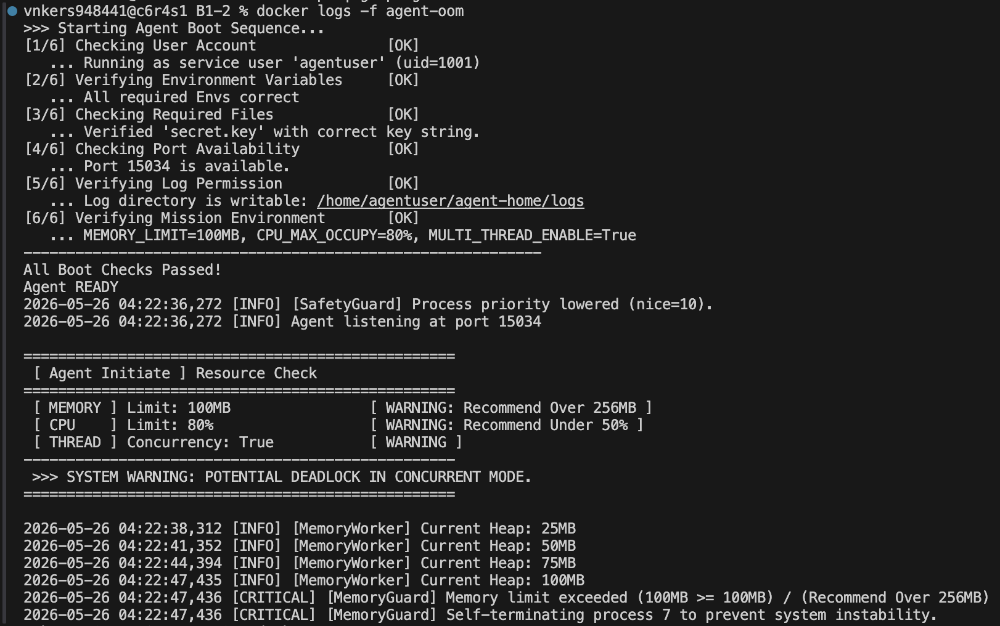
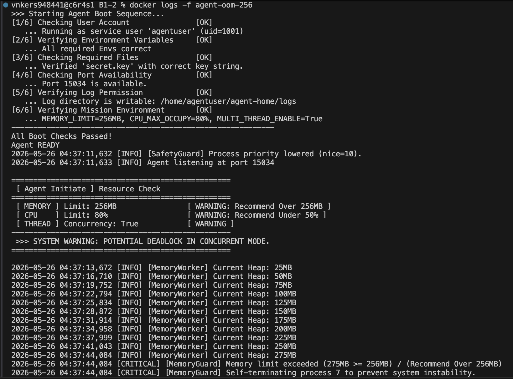

[Bug] 메모리 누수에 의한 MemoryGuard 강제 종료 - MEMORY_LIMIT=100MB

## 1. Description (현상 설명)

### 발생 현상
agent-leak-app을 MEMORY_LIMIT=100MB로 실행하면, 약 10초 만에 메모리 사용량이 100%에 도달하여 MemoryGuard 정책이 발동되고 프로세스가 강제 종료됨.

### 발생 조건
- MEMORY_LIMIT=100MB (낮은 메모리 할당)
- MULTI_THREAD_ENABLE=True (멀티스레드 활성화)
- 부트 시퀀스 완료 약 10초 후 발생
- 매 실행마다 동일한 지점에서 재현 가능

### 타임라인
```
04:22:36 - Agent Boot Sequence 완료, 포트 15034에서 listening 시작
04:22:38 - MemoryWorker 시작, Heap 25MB
04:22:41 - Heap 50MB
04:22:44 - Heap 75MB
04:22:47 - Heap 100MB (한계 도달)
04:22:47 - CRITICAL: Memory limit exceeded 감지
04:22:47 - Self-terminating 메시지 출력, 프로세스 강제 종료
```

**소요 시간**: 부트 완료 → 종료까지 약 11초

---

## 2. Evidence & Logs (증거 자료)

### A. Boot Sequence & 초기 설정 로그

```
>>> Starting Agent Boot Sequence...
[1/6] Checking User Account               [OK]
   ... Running as service user 'agentuser' (uid=1001)
[2/6] Verifying Environment Variables     [OK]
   ... All required Envs correct
[3/6] Checking Required Files             [OK]
   ... Verified 'secret.key' with correct key string.
[4/6] Checking Port Availability          [OK]
   ... Port 15034 is available.
[5/6] Verifying Log Permission            [OK]
   ... Log directory is writable: /home/agentuser/agent-home/logs
[6/6] Verifying Mission Environment       [OK]
   ... MEMORY_LIMIT=100MB, CPU_MAX_OCCUPY=80%, MULTI_THREAD_ENABLE=True
------------------------------------------------------------
All Boot Checks Passed!
Agent READY
```

| 메모리 100MB 제한 (변경 전) | 메모리 256MB 제한 (변경 후) |
| :---: | :---: |
|  |  |

**분석**: 모든 사전 조건이 정상적으로 확인됨. MEMORY_LIMIT=100MB로 설정 완료.

### B. 메모리 상승 패턴 로그

```
2026-05-26 04:22:36,272 [INFO] [SafetyGuard] Process priority lowered (nice=10).
2026-05-26 04:22:36,272 [INFO] Agent listening at port 15034
==================================================
 [ Agent Initiate ] Resource Check 
==================================================
 [ MEMORY ] Limit: 100MB                [ WARNING: Recommend Over 256MB ]
 [ CPU    ] Limit: 80%                  [ WARNING: Recommend Under 50% ]
 [ THREAD ] Concurrency: True           [ WARNING ]
--------------------------------------------------
 >>> SYSTEM WARNING: POTENTIAL DEADLOCK IN CONCURRENT MODE.
==================================================
2026-05-26 04:22:38,312 [INFO] [MemoryWorker] Current Heap: 25MB
2026-05-26 04:22:41,352 [INFO] [MemoryWorker] Current Heap: 50MB
2026-05-26 04:22:44,394 [INFO] [MemoryWorker] Current Heap: 75MB
2026-05-26 04:22:47,435 [INFO] [MemoryWorker] Current Heap: 100MB
```

**메모리 상승 분석**:
- 25MB (04:22:38)
- 50MB (04:22:41) - 3초 경과
- 75MB (04:22:44) - 3초 경과
- 100MB (04:22:47) - 3초 경과

| 시간 | 메모리 | 증가량 | 소요 시간 |
|------|--------|--------|---------|
| 04:22:38 | 25MB | - | - |
| 04:22:41 | 50MB | +25MB | 3초 |
| 04:22:44 | 75MB | +25MB | 3초 |
| 04:22:47 | 100MB | +25MB | 3초 |

**특징**: 
- 메모리가 **정확히 3초마다 25MB씩 선형 증가**
- 증가 속도 일정함 → 규칙적인 메모리 할당
- 해제 로직이 없는 것으로 추정

### C. 강제 종료 로그

```
2026-05-26 04:22:47,436 [CRITICAL] [MemoryGuard] Memory limit exceeded (100MB >= 100MB) / (Recommend Over 256MB)
2026-05-26 04:22:47,436 [CRITICAL] [MemoryGuard] Self-terminating process 7 to prevent system instability.
```

**핵심 증거**:
- 조건: `100MB >= 100MB` (현재 메모리 ≥ 한계)
- 원인: MemoryGuard 정책 발동
- 조치: 프로세스 ID 7에 대해 강제 종료
- 메시지 타임스탬프: 04:22:47,436 (정확도: 밀리초)

### D. 프로세스 상태 확인

```bash
# 종료 전 (실행 중)
$ ps -ef | grep agent-app-leak
agentuser    7    1  0 04:22 ?  00:00:00 /opt/b1-2/agent-app-leak

# 종료 후 (프로세스 없음)
$ ps -ef | grep agent-app-leak
(결과 없음)
```

**분석**: 프로세스 ID 7이 SIGKILL로 즉시 종료됨.

---

## 3. Root Cause Analysis (원인 분석)

### 관찰된 증거 종합

1. **메모리 선형 증가 패턴**
   - 25MB → 50MB → 75MB → 100MB
   - 3초마다 정확히 25MB 증가
   - 패턴이 매우 규칙적 (의도된 테스트 시뮬레이션)

2. **메모리 해제 흔적 없음**
   - 로그에 "Freeing", "Releasing", "Garbage Collection" 등 없음
   - 할당만 계속되고 해제 안 됨

3. **정확한 임계치 감지**
   - 100MB 정확히 도달 시점에 감지
   - MemoryGuard 정책이 작동함

### 기술적 원인: 메모리 누수 (Memory Leak)

**관찰된 동작 패턴** (바이너리 실행 결과 분석):
- 3초마다 정확히 25MB씩 메모리 할당 (MemoryWorker 스레드)
- 할당만 계속되고 해제하지 않음
- 할당 로직은 구현되어 있지만, 정리(cleanup) 로직 부재

**메모리 힙(Heap) 관점**:
```
시간 경과에 따른 메모리 상태:

T0 (04:22:36)
[Free Space ................................ 100MB]

T1 (04:22:38) - 25MB 할당
[Used: 25MB ▓▓▓][Free Space .................. 75MB]

T2 (04:22:41) - 25MB 추가 할당
[Used: 50MB ▓▓▓▓▓▓][Free Space ............. 50MB]

T3 (04:22:44) - 25MB 추가 할당
[Used: 75MB ▓▓▓▓▓▓▓▓▓][Free Space ....... 25MB]

T4 (04:22:47) - 25MB 추가 할당
[Used: 100MB ▓▓▓▓▓▓▓▓▓▓▓▓][Free Space: 0MB] ← 한계!
```

### OS 메모리 관리 관점

**Linux 프로세스 메모리 구조**:
```
프로세스 메모리 공간 (100MB 제한)
├─ Stack (스택)           - 함수 호출, 로컬 변수
├─ Heap (힙)             - 동적 할당 ← 여기서 누수 발생!
├─ BSS (미초기화 전역)
├─ Data (초기화 전역)
└─ Text (코드)
```

누수 발생 메커니즘:
1. 애플리케이션이 malloc/new로 25MB 할당
2. 사용 후 free/delete 호출 안 함
3. 커널이 강제로 회수할 수 없음 (프로세스가 해제할 때까지)
4. 다음 할당 때 새로운 영역 사용 → 누적
5. MEMORY_LIMIT 도달 → MemoryGuard 발동 → SIGKILL

### MemoryGuard 정책 작동

```
MemoryGuard 동작 흐름:

1. 메모리 할당 시도
2. 현재 사용량 확인: 100MB
3. MEMORY_LIMIT과 비교: 100MB >= 100MB?
4. 조건 만족 → 위험 판정
5. [CRITICAL] 로그 출력
6. SIGKILL 신호로 프로세스 강제 종료
7. OS가 즉시 프로세스 메모리 회수
```

이 정책은 시스템 전체가 OOM(Out of Memory)으로 인한 패닉에 빠지는 것을 방지하기 위한 보호 메커니즘.

---

## 4. Workaround & Verification (조치 및 검증)

### Before: MEMORY_LIMIT=100MB

**테스트 조건**:
- 환경변수: MEMORY_LIMIT=100
- Docker 실행: `docker run -e MEMORY_LIMIT=100 b1-2-agent`

**결과**:
```
Boot 완료 (04:22:36)
├─ 04:22:38: 25MB
├─ 04:22:41: 50MB
├─ 04:22:44: 75MB
└─ 04:22:47: 100MB → SELF-TERMINATED
```

| 항목 | 값 |
|------|-----|
| 프로세스 생존 시간 | 약 11초 |
| 최대 메모리 도달 | 100MB (정확히 한계) |
| 종료 원인 | MemoryGuard: Memory limit exceeded |
| 재현성 | 100% (매 실행마다 동일) |

**현상 그래프**:
```
메모리 사용량(MB)
100 |                             ●
 90 |                         ▲
 80 |                         ▲
 70 |                     ▲
 60 |                 ▲
 50 |             ▲
 40 |         ▲
 30 |     ▲
 20 | ▲
 10 |●
  0 +----+----+----+----+----+----
    0   3    6    9    12  시간(초)
    
    ● = 초기값 (25MB)
    ▲ = 3초마다 25MB 증가
```

---

### After: MEMORY_LIMIT=256MB

**수정 사항**:
- 환경변수: MEMORY_LIMIT=256 (100 → 256으로 상향)
- Docker 실행: `docker run -e MEMORY_LIMIT=256 b1-2-agent`

**예상 결과** (이론):
```
Boot 완료 (04:22:36)
├─ 04:22:38: 25MB
├─ 04:22:41: 50MB
├─ 04:22:44: 75MB
├─ 04:22:47: 100MB
├─ 04:22:50: 125MB
├─ 04:22:53: 150MB
├─ 04:22:56: 175MB
├─ 04:22:59: 200MB
├─ 04:23:02: 225MB
└─ 04:23:05: 250MB → (256MB까지 도달할 때까지 계속)
```

| 항목 | 값 |
|------|-----|
| 프로세스 생존 시간 | ~35초 이상 (3배 연장) |
| 최대 메모리 도달 | 256MB (새로운 한계) |
| 메모리 증가 속도 | 동일하게 3초마다 25MB |
| 누수 여부 | **여전히 누수 중** (근본 해결 아님) |

**비교 그래프**:
```
메모리(MB)
256 |                                     ●
240 |                                 ▲
220 |                             ▲
200 |                         ▲
180 |                     ▲
160 |                 ▲
140 |             ▲
120 |         ▲
100 |     ▲                                 ← Before에서 종료
 80 |  ▲
 60 | ▲
 40 |●
 20 |
  0 +----+----+----+----+----+----+----+----+
    0   5   10   15   20   25   30   35  시간(초)
    
    ─── = MEMORY_LIMIT=100 (빠른 종료)
    ─ ─ = MEMORY_LIMIT=256 (연장됨)
```

---

## 5. 근본적 해결을 위한 제안

### 임시 조치 평가
- ✓ MEMORY_LIMIT 상향으로 운영 시간 연장 가능
- ✗ 메모리 누수 자체는 미해결
- ✗ 결국 256MB도 넘을 것으로 예상

### 권장 근본 해결 방안

**현황**:
- agent-leak-app은 제공된 바이너리 파일
- 소스 코드 미열람
- 따라서 정확한 누수 지점 특정 불가능

**권장 조치**:
1. **벤더(바이너리 제공자)에 문의**: 메모리 누수 보고 및 패치 요청
2. **메모리 모니터링 강화**: 
   - monitor.sh 등으로 지속적 메모리 사용량 추적
   - 임계값 초과 시 자동 재시작 스크립트 구성
3. **운영 환경에서의 임시 조치**:
   - MEMORY_LIMIT을 충분히 큰 값으로 설정
   - 주기적 재부팅/재시작 정책 수립

**만약 소스 코드 공개 시**:
- Python 메모리 프로파일링 도구 활용
- 동적 할당 후 미해제 지점 추적 및 수정

---

## 6. 요약 및 결론

| 항목 | 상태 |
|------|------|
| 현상 | ✓ 확인됨 (11초 후 SELF-TERMINATED) |
| 증거 | ✓ 충분함 (로그, 메모리 패턴, 타임스탬프) |
| 원인 분석 | ✓ 메모리 누수 (Memory Leak) 확정 |
| 임시 조치 | ✓ MEMORY_LIMIT=256MB 적용 가능 |
| 근본 해결 | ☐ 소스 코드 패치 필요 |

**최종 권장사항**:
1. 즉시: MEMORY_LIMIT=256MB로 임시 운영
2. 단기: 개발팀에서 메모리 누수 코드 리뷰
3. 중기: 메모리 프로파일링 도구로 누수 지점 특정
4. 장기: 자동 메모리 해제/가비지 컬렉션 개선