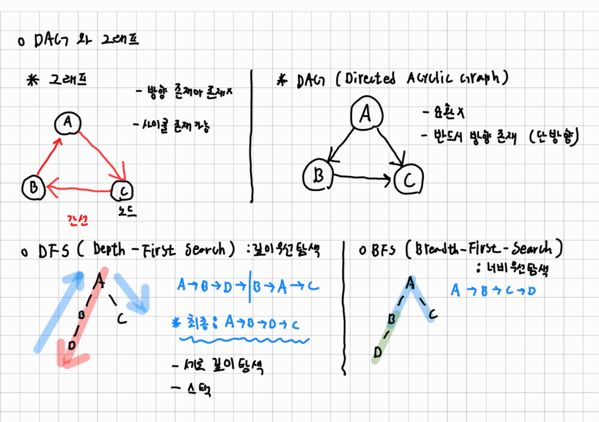
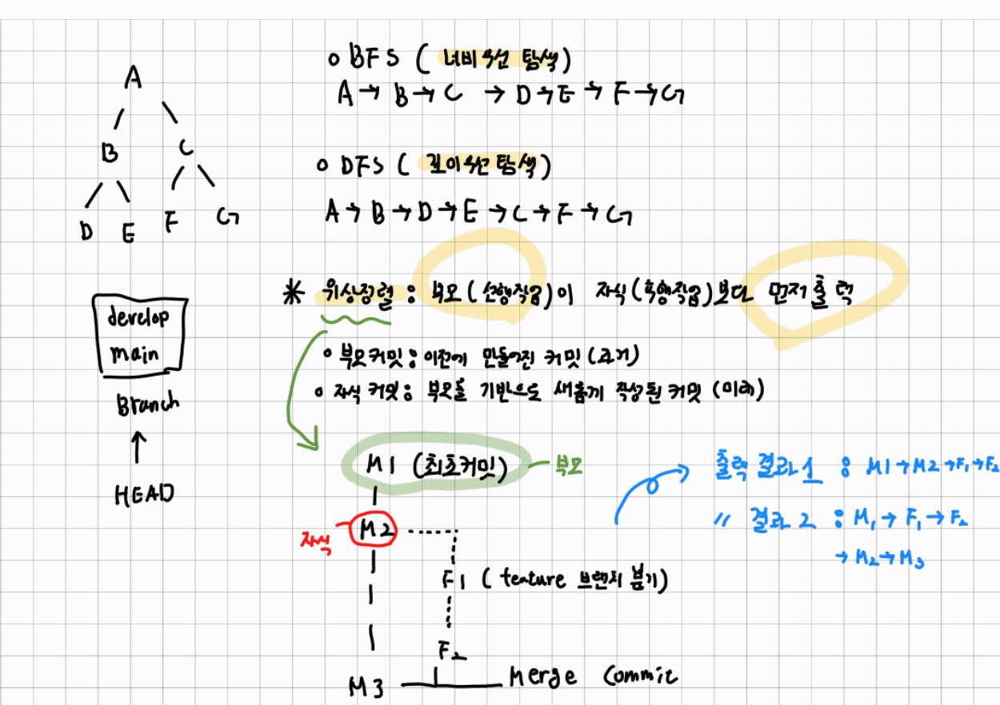
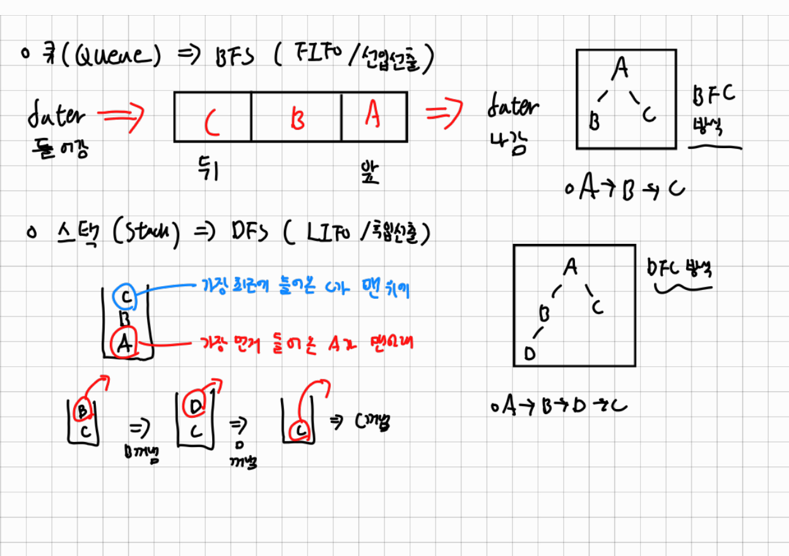
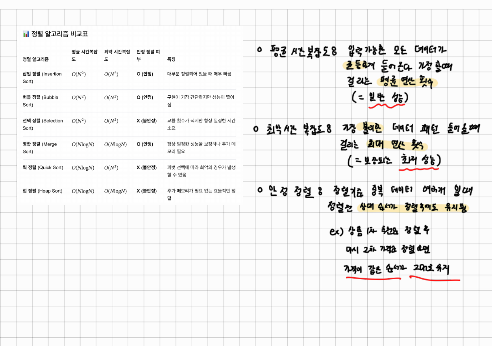

# Mini Git

Git의 핵심 구조(커밋 그래프 DAG, 브랜치, 위상 정렬, BFS, 역색인, 직접 구현한 정렬)를
직접 구현한 CLI 프로그램입니다. (`sorted()`/`list.sort()` 미사용)

## 실행 방법 (필수 제출물: main.py + README.md)

이 폴더(`B3-2_Mini_Git`)에서:

```bash
python -m mini_git.main
# 또는
python mini_git/main.py
```

`mini-git>` 프롬프트에 명령어를 입력합니다. 종료는 `exit` 또는 `quit`.

## 명령어 목록

| 명령어 | 예시 | 설명 |
|--------|------|------|
| INIT | `init "Alice"` | 저장소 초기화 + main 브랜치 생성 + 사용자 설정 |
| COMMIT | `commit "Initial commit"` | 새 커밋 생성 (역색인 갱신) |
| BRANCH | `branch feature` | 현재 HEAD 커밋을 가리키는 새 브랜치 생성 |
| SWITCH | `switch feature` | HEAD를 해당 브랜치로 이동 |
| LOG | `log` | **부모가 항상 자식보다 먼저** 출력되는 로그 |
| LOG 정렬 | `log --sort-by=date` / `--sort-by=author` | 직접 만든 병합 정렬로 정렬 출력 |
| PATH | `path <hash1> <hash2>` | 무방향 최단 경로. 없으면 `No path`. 동률이면 사전순 최소 |
| ANCESTORS | `ancestors <hash>` | 도달 가능한 모든 조상 출력 |
| SEARCH | `search login` / `search --author=Alice` | 역색인 기반 즉시 검색 |

- 명령어는 대소문자 구분 없음 (INIT = init)
- 공백 있는 문자열은 따옴표로 감싸기
- 데이터는 메모리에서만 동작 (종료하면 사라짐 - 요구사항)

## 동작 원리 요약

- **커밋 그래프**: 부모는 항상 과거 커밋 -> 사이클 없는 DAG
- **위상 정렬**: DFS 후위 순회로 "부모 먼저" 순서 보장
- **최단 경로**: target에서 BFS로 거리 계산 후, 거리가 1 줄어드는 이웃 중 hash가 가장 작은 것을 골라 사전순 최소 경로 보장
- **역색인**: 메시지 공백 split + 소문자화한 토큰별 목록장을 미리 만들어 검색을 즉답으로
- **정렬**: 병합 정렬 직접 구현 (평균/최악 O(n log n), 안정 정렬)

## 학습 노트: DAG와 위상 정렬

직접 손으로 정리한 노트입니다.

| 1. DAG와 그래프, DFS/BFS | 2. 탐색 순서와 위상 정렬 |
|:---:|:---:|
|  |  |
| **3. 큐(BFS)와 스택(DFS)** | **4. 정렬 알고리즘 비교와 용어** |
|  |  |

<details>
<summary>노트 내용을 글로 정리한 버전 (펼치기)</summary>

### 그래프와 DAG

| 구분 | 그래프 | DAG (Directed Acyclic Graph) |
|------|--------|------------------------------|
| 방향 | 있을 수도, 없을 수도 있음 | 반드시 있음 (단방향) |
| 사이클 | 존재 가능 | 없음 (순환 X) |

- **노드**: 점, **간선**: 노드와 노드를 잇는 선
- `A→C`, `C→B`, `B→A`처럼 한 바퀴 돌아오면 사이클이 있는 그래프
- `A→B`, `A→C`, `B→C`처럼 되돌아오는 길이 없으면 DAG

### DFS와 BFS

| 구분 | DFS (Depth-First Search) | BFS (Breadth-First Search) |
|------|--------------------------|----------------------------|
| 이름 | 깊이 우선 탐색 | 너비 우선 탐색 |
| 방식 | 한 방향으로 끝까지 내려가 탐색 | 가까운 노드부터 층별로 탐색 |
| 자료구조 | 스택 (LIFO / 후입선출) | 큐 (FIFO / 선입선출) |

예시 1 (A의 자식 B, C / B의 자식 D)

- DFS: `A → B → D → C` (D까지 내려갔다가 B, A로 되돌아온 뒤 C)
- BFS: `A → B → C → D`

예시 2 (A의 자식 B, C / B의 자식 D, E / C의 자식 F, G)

- DFS: `A → B → D → E → C → F → G`
- BFS: `A → B → C → D → E → F → G`

**큐 (BFS)**: 먼저 들어간 것이 먼저 나옴. 예) `A → B → C` 순서로 탐색

```
데이터 들어감 ⇒ [ C | B | A ] ⇒ 데이터 나감
                뒤            앞
```

**스택 (DFS)**: 가장 최근에 들어온 것이 맨 위에 있고, 가장 먼저 들어온 것이 맨 아래에 있음

```
꺼내는 순서 예시 (맨 위 → 아래):
[B, C] → B 꺼냄 → [D, C] → D 꺼냄 → [C] → C 꺼냄      (A → B → D → C)
```

### 위상 정렬

**부모(선행 작업)가 자식(후행 작업)보다 먼저 출력**되도록 나열하는 것

- **부모 커밋**: 이전에 만들어진 커밋 (과거)
- **자식 커밋**: 부모를 기반으로 새롭게 작성된 커밋 (미래)
- **브랜치**: `main`, `develop`처럼 커밋을 가리키는 이름표이고, **HEAD**는 현재 브랜치를 가리킴

예시: `M1`(최초 커밋), `M2`, `F1`(feature 브랜치 분기), `F2`, `M3`(Merge Commit)

- 출력 결과 1: `M1 → M2 → F1 → F2 → M3`
- 출력 결과 2: `M1 → F1 → F2 → M2 → M3`

부모가 자식보다 먼저 나오기만 하면 되므로 위상 정렬 결과는 **하나로 정해지지 않을 수 있음**

### 정렬 알고리즘 비교

| 정렬 알고리즘 | 평균 시간복잡도 | 최악 시간복잡도 | 안정 정렬 | 특징 |
|---------------|-----------------|-----------------|-----------|------|
| 삽입 정렬 (Insertion) | O(N²) | O(N²) | O (안정) | 대부분 정렬되어 있을 때 매우 빠름 |
| 버블 정렬 (Bubble) | O(N²) | O(N²) | O (안정) | 구현이 가장 간단하지만 성능이 떨어짐 |
| 선택 정렬 (Selection) | O(N²) | O(N²) | X (불안정) | 교환 횟수가 적지만 항상 일정한 시간 소요 |
| 병합 정렬 (Merge) | O(N log N) | O(N log N) | O (안정) | 항상 일정한 성능을 보장하나 추가 메모리 필요 |
| 퀵 정렬 (Quick) | O(N log N) | O(N²) | X (불안정) | 피벗 선택에 따라 최악의 경우가 발생할 수 있음 |
| 힙 정렬 (Heap) | O(N log N) | O(N log N) | X (불안정) | 추가 메모리가 필요 없는 효율적인 정렬 |

- **평균 시간복잡도**: 입력 가능한 모든 데이터가 골고루 들어온다고 가정했을 때 걸리는 평균 연산 횟수 (= 일반 성능)
- **최악 시간복잡도**: 가장 불리한 데이터 패턴이 들어왔을 때 걸리는 최대 연산 횟수 (= 보장되는 최악 성능)
- **안정 정렬**: 정렬 기준이 같은 중복 데이터가 여러 개일 때, 정렬 전의 상대 순서가 정렬 후에도 유지됨
  - 예) 상품을 1차로 추천순 정렬한 뒤 다시 2차로 가격순 정렬하면, 가격이 같은 상품끼리는 추천순 순서가 그대로 유지됨

</details>

## 코드 구조

```
mini_git/
├── main.py        시작점. REPL + 명령 파싱
├── graph.py       커밋/브랜치/HEAD 관리 (DAG)
├── index.py       역색인 (키워드/작성자)
└── algorithms.py  병합 정렬 / 위상 정렬 / BFS 경로 / 조상 탐색
```
