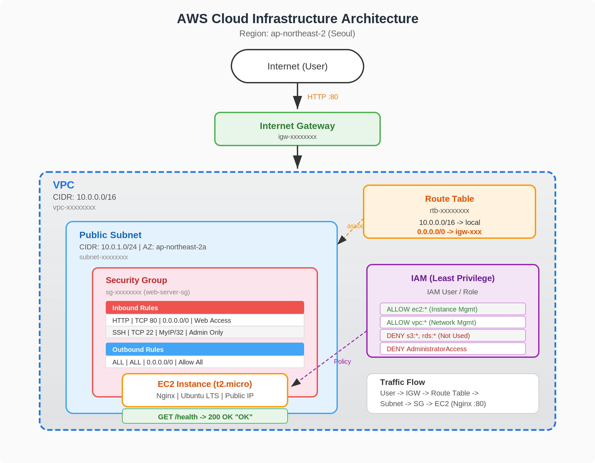

# AWS 클라우드 인프라 구축 프로젝트

## 프로젝트 개요

AWS VPC 기반의 격리된 네트워크 환경에서 Nginx 웹 서버를 배포하고, 최소 권한 원칙을 적용한 보안 설정으로 외부 접속 가능한 인프라를 구축한다.

## 아키텍처



### 구성 요소

| 구성 요소 | 리소스명 | 설정값 |
|----------|---------|-------|
| VPC | cloud-lab-vpc | 10.0.0.0/16 |
| Public Subnet | cloud-lab-public-subnet | 10.0.1.0/24 (ap-northeast-2a) |
| Internet Gateway | cloud-lab-igw | VPC에 연결 |
| Route Table | cloud-lab-public-rt | 0.0.0.0/0 → IGW |
| Security Group | cloud-lab-web-sg | HTTP 80 전체, SSH 22 개인IP |
| EC2 | cloud-lab-web-server | t2.micro, Ubuntu LTS |
| 웹 서버 | Nginx | 포트 80, /health 엔드포인트 포함 |

### 트래픽 흐름

```
사용자 (인터넷)
    ↓ HTTP :80
Internet Gateway (cloud-lab-igw)
    ↓
Route Table (0.0.0.0/0 → IGW)
    ↓
Public Subnet (10.0.1.0/24)
    ↓
Security Group (TCP 80 허용 확인)
    ↓
EC2 Instance → Nginx (:80) → 응답 반환
```

## 외부 접속 검증

### 선택 방식: **(B) 헬스체크 API**

헬스체크 방식을 선택한 이유:
- 프로그래밍적 검증이 가능하여 자동화에 적합
- 현업의 ALB Target Group 헬스체크, 모니터링 시스템 패턴과 동일
- HTTP 상태 코드(200)와 고정 응답("OK")으로 명확한 성공/실패 판단 가능

### 접속 정보

```bash
# 헬스체크 (옵션 B)
curl http://<퍼블릭IP>/health
# 기대 응답: 200 OK, Body: "OK"

# 브라우저 접속도 가능 (옵션 A)
# http://<퍼블릭IP> → "Hello Cloud!" 페이지 표시
```

### 검증 명령어

```bash
# 상태 코드 확인
curl -s -o /dev/null -w "%{http_code}" http://<퍼블릭IP>/health
# 출력: 200

# 응답 본문 확인
curl -s http://<퍼블릭IP>/health
# 출력: OK

# SSH 접속 확인
ssh -i my-cloud-key.pem ubuntu@<퍼블릭IP>

# 인스턴스 내부에서 로컬 확인
curl http://localhost
# 출력: Hello Cloud! 페이지 HTML

# 아웃바운드 통신 확인
curl https://example.com
# 출력: 정상 HTML 응답
```

## Nginx /health 엔드포인트 설정

`/etc/nginx/sites-available/default` 에 추가된 설정:

```nginx
location /health {
    access_log off;
    return 200 'OK';
    add_header Content-Type text/plain;
}
```

## Security Group 설정

| 방향 | 프로토콜 | 포트 | 소스/대상 | 용도 |
|------|---------|------|----------|------|
| Inbound | TCP | 80 | 0.0.0.0/0 | 웹 서비스 접근 |
| Inbound | TCP | 22 | 개인IP/32 | SSH 관리 접근 |
| Outbound | ALL | ALL | 0.0.0.0/0 | 인터넷 아웃바운드 |

**전체 포트 개방(0-65535)은 적용하지 않음** — 필요한 포트만 최소한으로 허용.

## IAM 권한 설정

| 허용 서비스 | 허용 작업 |
|-----------|----------|
| EC2 | 인스턴스 생성, 조회, 종료, 태그 관리 |
| VPC | VPC/Subnet/IGW/RT 생성, 조회, 삭제 |
| Security Group | 생성, 규칙 추가/삭제, 조회 |
| EBS | 볼륨 생성, 삭제, 조회 |
| Cost Explorer | 비용 조회 (읽기 전용) |

**차단**: S3, RDS, Lambda 등 실습 무관 서비스. **AdministratorAccess 미부여**.

## 실행 방법

```bash
# 1. IAM 사용자 생성 (루트 계정에서 1회 실행)
chmod +x setup-iam.sh
./setup-iam.sh

# 2. IAM 사용자로 AWS CLI 재설정
aws configure  # IAM 사용자의 Access Key 입력

# 3. 인프라 구축
chmod +x setup-infrastructure.sh
./setup-infrastructure.sh

# 4. 실습 종료 후 리소스 정리
chmod +x cleanup-infrastructure.sh
./cleanup-infrastructure.sh
```

## 리소스 추적 기준

모든 리소스에 `Name` 태그를 `cloud-lab-` 접두사로 통일하여 관리:
- 필터링: AWS 콘솔에서 `cloud-lab-*` 검색으로 실습 리소스만 조회
- 정리 스크립트: 태그 기반으로 삭제 대상 자동 식별
- 비용 추적: Cost Explorer에서 태그별 비용 분석 가능

## 제출 파일 구조

```
B6-1/
├── README.md                      # 본 문서
├── setup-infrastructure.sh        # 인프라 구축 스크립트
├── setup-iam.sh                   # IAM 설정 스크립트
├── cleanup-infrastructure.sh      # 리소스 정리 스크립트
└── docs/
    ├── architecture.png           # 아키텍처 다이어그램
    ├── troubleshooting.md         # 트러블슈팅 보고서
    ├── cleanup-checklist.md       # 리소스 정리 체크리스트
    └── why-analysis.md            # WHY 분석 문서
```
